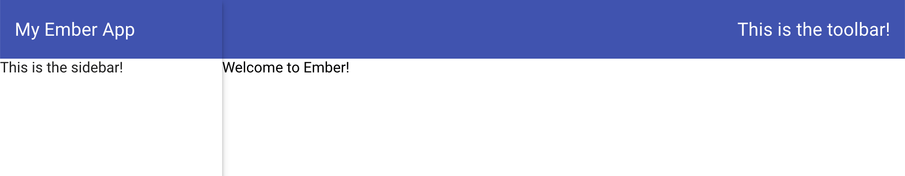
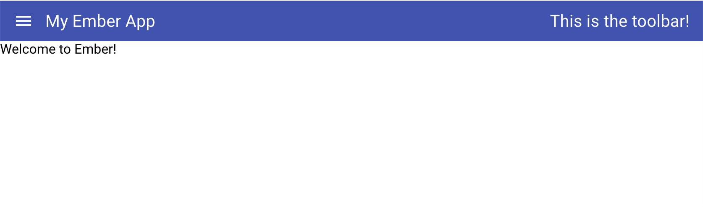
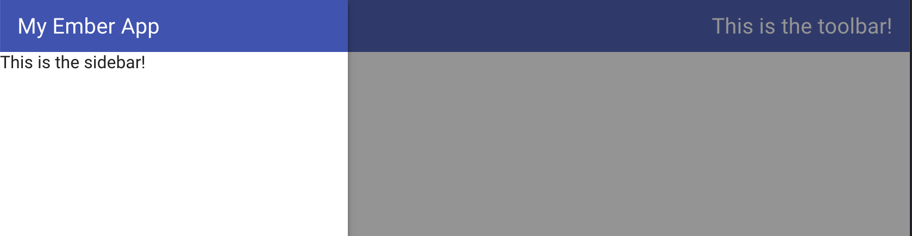
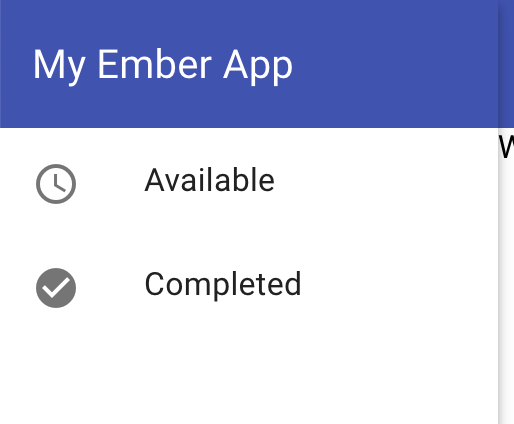
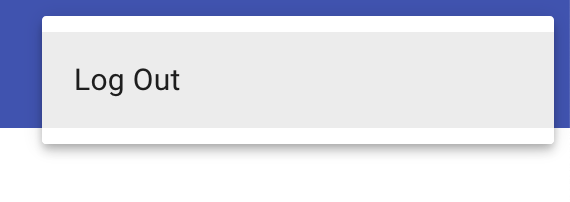

# ember-paper-layout

A mobile-friendly layout built using `ember-paper`.


## Compatibility

* Ember.js v3.12 or above
* Ember CLI v2.13 or above
* Node.js v10 or above


## Installation

```
$ ember install ember-paper
$ ember install ember-paper-layout
```

## Usage

This addon provides a single top-level `LayoutCountainer` component for the layout of the app. It yields a number of child components you can use to provide the sidenav, toolbar, and body of your page.

For example, if you put the following in `application.hbs`:

```hbs
<LayoutContainer @title="My Ember App" as |layout|>
  <layout.sidenav>
    This is the sidebar!
  </layout.sidenav>
  <layout.body as |body|>
    <body.toolbar @showSideNavToggle={{this.session.isAuthenticated}}>
      This is the toolbar!
    </body.toolbar>
    <body.content>
      {{outlet}}
    </body.content>
  </layout.body>
</LayoutContainer>
```

You will see the following:



Note that if you narrow the window to mobile size, the sidenav is hidden, and a menu icon appears in its place:



Clicking the menu icon shows the sidenav:




## Customization

Change the theme color of the app by setting the `$primary` variable in `app.scss`:

```scss
$primary: 'green';

@import 'ember-paper';
```

The `PaperList` component from `ember-paper` is a good choice for adding sidenav contents:

```hbs
<layout.sidenav>
  <PaperList>
    <PaperItem
      @onClick={{this.goToAvailable}}
    >
      {{paper-icon "access_time"}}
      <p>Available</p>
    </PaperItem>
    <PaperItem
      @onClick={{this.goToCompleted}}
    >
      {{paper-icon "check_circle"}}
      <p>Completed</p>
    </PaperItem>
  </PaperList>
</layout.sidenav>
```

This results in:



In the toolbar, it's typical to have one or more buttons, potentially showing menus when clicked:

```hbs
<body.toolbar>
  <PaperMenu as |menu|>
    <menu.trigger>
      <PaperButton @iconButton={{true}}>
        {{paper-icon "account_circle"}}
      </PaperButton>
    </menu.trigger>
    <menu.content @width={{4}} as |content|>
      <content.menu-item @onClick={{this.logOut}}>
        <span>Log Out</span>
      </content.menu-item>
    </menu.content>
  </PaperMenu>
</body.toolbar>
```

This results in:


And when clicked:



## Contributing

See the [Contributing](CONTRIBUTING.md) guide for details.


## License

This project is licensed under the [MIT License](LICENSE.md).
